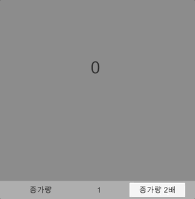

# Number

### 소개
클리커 게임 및 방치형 게임에서 많이 보이는 K, M, B, T, AA, AB 등과 같이 큰 숫자를 표현하기 위한 자료형 타입입니다.



### 설치방법
1. 패키지 관리자의 툴바에서 좌측 상단에 플러스 메뉴를 클릭합니다.
2. 추가 메뉴에서 Add package from git URL을 선택하면 텍스트 상자와 Add 버튼이 나타납니다.
3. https://github.com/DarkNaku/Number.git 입력하고 Add를 클릭합니다.

### 사용방법
```csharp
new Number(1); // 1
new Number(1000); // 1K
new Number(1, 1); // 1K
new Number(1, 2); // 1M
new Number(1, 3); // 1B
new Number("1"); // 1
new Number("1K"); // 1000
new Number("1M"); // 1000000
new Number("1B"); // 1000000000
new Number("1T"); // 1000000000000
new Number("1AA"); // 1000000000000000
new Number("-1"); // -1
new Number("-1K"); // -1000
new Number("-1M"); // -1000000

var number = new Number("1"); // 1

number++; // 2

number *= 10; // 20

number /= 10; // 2
```

* 1000자리 단위로 표시 단위가 바뀝니다. 
* 1000부터 단위 이하는 소수점으로 2자리까지 표시 됩니다. 
* 단위 종류는 1000부터 K, M, B, T, AA ~ ZZ (아마도?) 로 표시됩니다.
* 비교연산, 사칙연산, 형변환을 지원합니다.
* 직렬화 지원합니다.

### 추가설명
* 문자열로 부터서 생성하는 생성자는 내부적으로 정규표현식을 사용하기 때문에 많이 느릴 수 있습니다. 사용에 참고하시기 바랍니다.